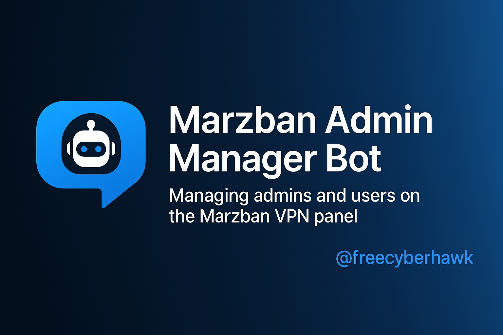

# 🤖 Marzban Admin Manager Bot

A Telegram bot for managing admins and users on the Marzban VPN panel. It includes wallet management, subscription
packages, and manual balance top-up approval by superusers.

## ✨ Features

### Superuser:

- Set per-GB pricing for each admin
- Define reusable subscription packages
- Manually add balance to admins
- Review and approve top-up invoices

### Admin:

- Create and renew subscriptions for their users
- Use superuser-defined packages
- View wallet balance and automatic deductions per GB
- Submit invoice images to request balance top-up

## ⚙️ Installation

```bash
git clone https://github.com/freecyberhawk/marzban-admin-bot.git
cd marzban-admin-bot
python -m venv venv
source venv/bin/activate  # On Windows: venv\Scripts\activate
pip install -r requirements.txt
python main.py
```

## 📝 Requirements

	•	Python 3.10+
	•	Telegram bot token from BotFather
	•	.env file for sensitive configs

## 👨‍💻 Developer

@freecyberhawk